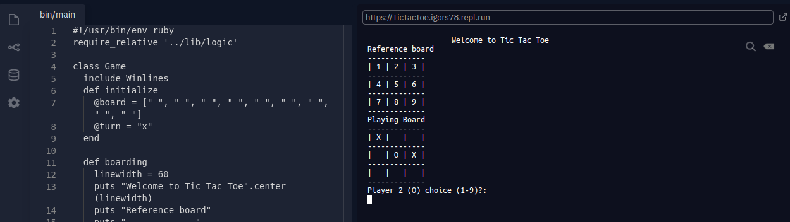

# TicTacToe

- In this project, the student builds a Tic Tac Toe game. The main goal is to
  put into practice the main concepts of Object Oriented Programming.
  Particularly, classes and access to their attributes.



# Getting Started

Tic-tac-toe (American English), noughts and crosses (Commonwealth English), or
Xs and Os, is a paper-and-pencil game for two players, X and O, who take turns
marking the spaces in a 3×3 grid. The player who succeeds in placing three of
their marks in a horizontal, vertical, or diagonal row is the winner. It is a
solved game with a forced draw assuming best play from both players. Please
follow the prompt to enter your move. Your cross (X) or your (O) will be placed
in the cell with corresponding number you enter, check reference board.

## Live Demo

[Live Demo Link](https://repl.it/@Igors78/TicTacToe#bin/main)

- Run the respective command `bin/main.rb` in repl terminal to start the game.

```
Reference board
-------------
| 1 | 2 | 3 |
-------------
| 4 | 5 | 6 |
-------------
| 7 | 8 | 9 |
-------------
Playing Board
-------------
|   |   |   |
-------------
|   |   |   |
-------------
|   |   |   |
-------------
Player 1 (X) choice (1-9)?:
```

- Follow the prompt as above to enter your respective cross or naught in the
  playing board, see numbers in reference board for easy navigation.
- Change your moves as prompted from one player to another.
- You will be notified who has won or if there is a tie.

## On your Computer

To get a local copy up and running follow these simple example steps.

### Prerequisites

- Any PC or device with internet connection and ability to use command line
  terminal

### Setup

- Open the command line terminal

### Install

- Go to your preferred directory
- Run `git clone https://github.com/Igors78/TicTacToe.git` command

### Usage

- Navigate to respective folder (TicTacToe) and type `bin/main.rb` in your
  terminal.
- Follow the instructions above for the live link.

### Run tests

- Tests passed can be found [here](https://github.com/Igors78/TicTacToe/pulls)

## Built with

- Ruby

## Author

👤 **Igors Oleinikovs**

- GitHub: [@githubhandle](https://github.com/Igors78)
- Twitter: [@twitterhandle](https://twitter.com/oleinikovs)
- LinkedIn: [LinkedIn](https://www.linkedin.com/in/igors-oleinikovs-17a10958/)

## 🤝 Contributing

Contributions, issues, and feature requests are welcome!

## Show your support

Give a ⭐️ if you like this project!

## Acknowledgments

- Ruby documentation
- [Ruby Guides](https://www.rubyguides.com/)

## 📝 License

This project is [UNLicense](./LICENSE) licensed.
